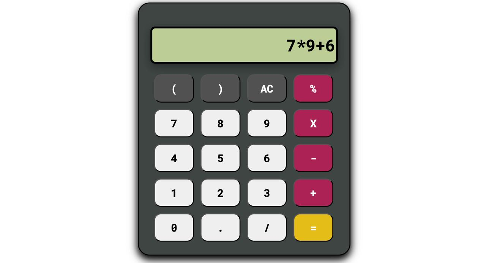

# 🫮 Calculator-Basic

A simple, responsive calculator built using HTML, CSS, and JavaScript. This project was developed as part of my academic coursework to strengthen my understanding of web development fundamentals.



---

## 📌 Table of Contents

- [About the Project](#📝-about-the-project)
- [Features](#✨-features)
- [Technologies Used](#🛠%ef%b8%8f-technologies-used)
- [Getting Started](#🚀-getting-started)
- [Project Structure](#📁-project-structure)
- [Learnings and Experience](#📚-learnings-and-experience)
- [Future Enhancements](#🔮-future-enhancements)
- [Contributing](#🤝-contributing)
- [License](#📄-license)

---

## 📝 About the Project

The **Calculator-Basic** project is a web-based calculator that performs basic arithmetic operations. It was created to apply and demonstrate my skills in front-end web development, particularly in structuring HTML, styling with CSS, and scripting with JavaScript.

---

## ✨ Features

- Perform basic arithmetic operations: addition, subtraction, multiplication, and division.
- Responsive design suitable for various screen sizes.
- Clear and intuitive user interface.
- Error handling for invalid inputs.

---

## 🛠️ Technologies Used

- **HTML5**: Structuring the content of the calculator.
- **CSS3**: Styling the calculator for a clean and responsive design.
- **JavaScript (ES6)**: Implementing the logic for calculator operations and interactivity.

---

## 🚀 Getting Started

To run the calculator locally:

1. **Clone the repository:**

   ```bash
   git clone https://github.com/rohan-badugula/Calculator-Basic.git
   ```

2. **Navigate to the project directory:**

   ```bash
   cd Calculator-Basic
   ```

3. **Open `index.html` in your preferred web browser.**

Alternatively, you can use a live server extension in your code editor for real-time preview.

---

## 📁 Project Structure

```
Calculator-Basic/
├── index.html        # Main HTML file
├── style.css         # Stylesheet for styling the calculator
├── index.js          # JavaScript file containing calculator logic
```

---

## 📚 Learnings and Experience

Developing this calculator allowed me to:

- Reinforce my understanding of the Document Object Model (DOM) and how to manipulate it using JavaScript.
- Practice event handling to capture and respond to user interactions.
- Implement responsive design principles to ensure usability across devices.
- Enhance problem-solving skills by debugging and refining the calculator's functionality.

This project served as a practical application of my coursework in web development and provided a foundation for more complex projects in the future.

---

## 🔮 Future Enhancements

- **Scientific Functions**: Incorporate advanced operations like trigonometric functions, logarithms, etc.
- **Keyboard Support**: Enable users to interact with the calculator using keyboard inputs.
- **History Feature**: Maintain a log of previous calculations for user reference.
- **Theme Toggle**: Allow users to switch between light and dark modes.

---

## 🤝 Contributing

Contributions are welcome! If you have suggestions or improvements, feel free to fork the repository and submit a pull request.

---

## 📄 License

This project is licensed under the [MIT License](LICENSE).
